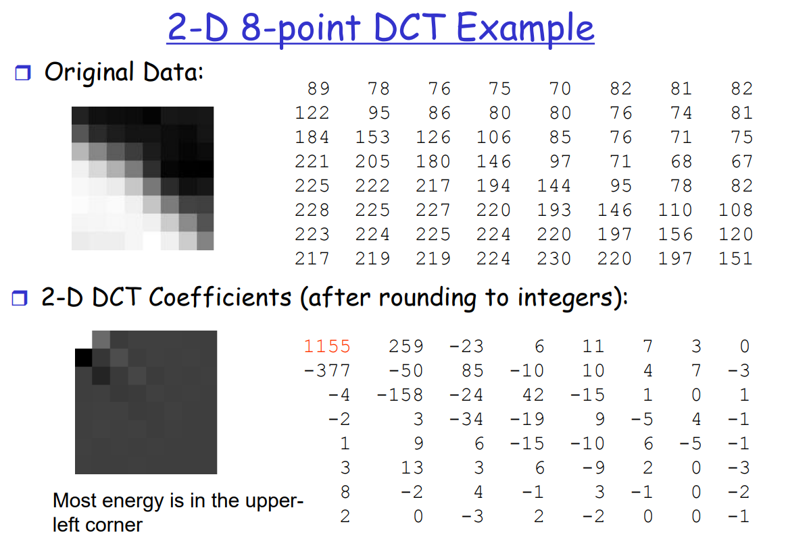

# Discrete-Cosine-Transform
The discrete cosine transform (DCT) helps separate the image into parts (or spectral sub-bands) of differing importance (with respect to the image's visual quality). The DCT is similar to the discrete Fourier transform: it transforms a signal or image from the spatial domain to the frequency domain.

### DCT Encoding

$$
C_{i, j} = a_i\cos(\frac{(2j+1)i\pi}{2N})\space , \space i, j = 0, ..., N-1
\\
a_i=\left\{
\begin{aligned}
\sqrt{\frac1N} \space \space & for \space i=0 \\
\sqrt{\frac2N} \space \space & for \space i=1, 2, ..N-1 \\
\end{aligned}
\right.
\\
Y = CXC^T
X = C^TYC
$$

